# ViPNet Coordinator RAG — вопрос-ответ по документации

RAG-система для документации ViPNet Coordinator HW 5: парсинг PDF в чанки, гибридный поиск (эмбеддинги E5 + BM25, RRF), реранкинг и генерация ответов через Yandex GPT / Qwen.

---

## Содержание

- [Возможности](#возможности)
- [Пайплайн](#пайплайн)
- [Требования](#требования)
- [Установка и настройка](#установка-и-настройка)
- [Запуск](#запуск)
- [API (FastAPI)](#api-fastapi)
- [Оценка качества и результаты](#оценка-качества-и-результаты)
- [Конфигурация](#конфигурация)
- [Docker](#docker)
- [Структура проекта](#структура-проекта)
- [Документация](#документация)
- [Частые вопросы](#частые-вопросы)

---

## Возможности

- **Парсинг PDF** — извлечение по блокам, сегментация по оглавлению, семантический chunking (CLI, таблицы, инструкции, теория).
- **Гибридный поиск** — FAISS (эмбеддинги E5) + BM25, слияние через RRF; опционально расширение запроса.
- **Реранкинг** — CrossEncoder (BAAI/bge-reranker-v2-m3).
- **Генерация** — Yandex Cloud REST API (Yandex GPT / Qwen); контекст из найденных чанков.
- **Режимы:** интерактивный чат (`python main.py`), FastAPI (`python main.py app`), оценка качества (`python main.py eval`).

---

## Пайплайн

Полный пайплайн: от PDF до ответа пользователю.

```mermaid
flowchart TB
  subgraph prep["Подготовка (один раз)"]
    A[PDF] --> B[Парсинг PyMuPDF]
    B --> C[Очистка, сегментация по TOC]
    C --> D[Семантический chunking]
    D --> E[dataset.json]
    E --> F[Эмбеддинги E5]
    E --> G[Токенизация]
    F --> H[FAISS индекс]
    G --> I[BM25 корпус]
  end

  subgraph query["Запрос → ответ (FAISS + BM25 из подготовки)"]
    J[Вопрос] --> K[Расширение запроса]
    K --> L[Кодирование E5]
    L --> M[FAISS top-50]
    L --> N[BM25 top-50]
    M --> O[RRF]
    N --> O
    O --> P[Реранкер BGE]
    P --> Q[Топ-6 чанков]
    Q --> R[Контекст + промпт]
    R --> S[LLM Yandex GPT]
    S --> T[Форматирование]
    T --> U[Ответ + источники]
  end
```



**Кратко по этапам:**

| Этап | Описание |
|------|----------|
| **Подготовка** | PDF → парсинг → очистка → сегментация по оглавлению → chunking по типу контента (CLI, таблицы, инструкции и т.д.) → `dataset.json`. Чанки векторизуются (E5, префикс `passage:`) → FAISS; тот же текст токенизируется → корпус BM25. |
| **Запрос** | Вопрос пользователя → опционально расширение (эвристики или перефразирование через LLM) → кодирование запроса (E5, префикс `query:`) → поиск FAISS (top-50) и BM25 (top-50) → слияние рангов через RRF → реранкирование (BGE) → топ-6 чанков. |
| **Генерация** | Топ-6 чанков собираются в контекст → в промпт добавляются системный промпт, контекст и вопрос → вызов LLM (Yandex GPT / Qwen) → ответ → постобработка (форматирование, удаление артефактов) → пользователю возвращаются текст ответа и источники (doc, chapter, section_id). |

---

## Требования

- Python 3.11 (рекомендуется).
- Интернет для первой загрузки моделей Hugging Face (или Docker-образ с предзагруженными моделями).
- **Yandex Cloud:** API-ключ и Folder ID для LLM (см. [docs/YANDEX_CLOUD_MODEL.md](docs/YANDEX_CLOUD_MODEL.md)).

---

## Установка и настройка

```bash
cd /path/to/project
python3.11 -m venv venv
source venv/bin/activate   # Linux/macOS  |  venv\Scripts\activate  # Windows
pip install -r requirements.txt
cp .env.example .env
```

В `.env` **обязательно** заполните:

- **YANDEX_CLOUD_FOLDER** — идентификатор каталога Yandex Cloud.
- **YANDEX_CLOUD_API_KEY** — API-ключ.
- **YANDEX_CLOUD_MODEL** — идентификатор модели (например `qwen2.5-7b-instruct/latest`).

Подробнее: [docs/YANDEX_CLOUD_MODEL.md](docs/YANDEX_CLOUD_MODEL.md).

Положите PDF в папку из **INPUT_DIR** (по умолчанию `data/ViPNet Coordinator HW 5.3.2_docs`). При первом запуске `python main.py` или `python main.py app` при необходимости выполнится парсинг и построение индексов.

---

## Запуск

| Режим | Команда |
|-------|---------|
| Чат в терминале | `python main.py` |
| FastAPI-сервер | `python main.py app` (порт 8000, документация: `/docs`) |
| Оценка качества RAG | `python main.py eval` или `python -m rag_benchmark.run_all` |

---

## API (FastAPI)

| Метод | Путь | Описание |
|--------|------|----------|
| GET | `/health` | Проверка доступности. |
| GET | `/preprocess/status` | Наличие dataset, embeddings, faiss, bm25; поле `ready`. |
| POST | `/preprocess/parse` | Парсинг PDF из папки в dataset.json. Тело: `{"input_dir": "data/docs"}` или пусто. |
| POST | `/preprocess/index` | Построение эмбеддингов, FAISS, BM25 из dataset.json. После parse. |
| POST | `/preprocess/reload` | Сброс кэша RAG. |
| POST | `/ask` | Вопрос к RAG. Тело: `{"question": "..."}`. Ответ: `answer` + `sources` (doc, chapter, section_id). |

Типичный сценарий: `GET /preprocess/status` → при необходимости `POST /preprocess/parse` и `POST /preprocess/index` → `POST /ask`.

---

## Оценка качества и результаты

Бенчмарк генерирует тестовые вопросы из чанков (Literal, Paraphrase, Scenario), считает метрики retrieval (Recall@k, MRR@k, nDCG@k) и end-to-end (Semantic Similarity, F1_token). Подробнее о формулах: [docs/Оценка_качества_RAG.md](docs/Оценка_качества_RAG.md).

### Пример результатов (report.txt)

Оценка на выборке запросов (literal + paraphrase/scenario):

**Retrieval (все запросы):**

| k | Recall@k | MRR@k | nDCG@k |
|---|----------|-------|--------|
| 1 | 0.19 | 0.19 | 0.19 |
| 5 | 0.50 | 0.31 | 0.36 |
| 10 | 0.57 | 0.32 | 0.38 |
| 20 | 0.71 | 0.33 | 0.42 |

**По типам запросов:**

- **Literal** (n=28): Recall@20 ≈ 0.96, MRR@5 ≈ 0.61, nDCG@5 ≈ 0.65 — при формулировках «в лоб» релевантный чанк чаще в топ-5.
- **Paraphrase/Scenario** (n=84): Recall@20 ≈ 0.63, MRR@5 ≈ 0.21 — снижение ожидаемо при перефразировании и сценарных вопросах.

**End-to-End:**

| Метрика | Значение |
|---------|----------|
| **Semantic Similarity** | 0.87 |
| **F1_token** | 0.33 |

Semantic Similarity 0.87 соответствует уровню **production-grade** (порог 0.8+). F1_token дополняет смысловую метрику лексическим перекрытием.

Запуск с параметрами:

```bash
python -m rag_benchmark.run_all --samples 30 --e2e-limit 20 --eval-mode all --output report.json
```

---

## Конфигурация

Основные переменные в `.env` (см. `.env.example`):

| Переменная | Назначение | По умолчанию |
|------------|------------|--------------|
| **RAG_DATA_DIR** | Каталог данных (dataset, эмбеддинги, индексы) | `data` |
| **INPUT_DIR** | Папка с PDF для парсинга | `data/ViPNet Coordinator HW 5.3.2_docs` |
| **DATASET_JSON**, **OUTPUT_EMBEDDINGS**, **FAISS_INDEX**, **BM25_CORPUS_JSON** | Пути к артефактам | в RAG_DATA_DIR |
| **EMBED_MODEL** | Модель эмбеддингов (Hugging Face) | `intfloat/multilingual-e5-large` |
| **VECTORIZE_DEVICE** | Устройство для эмбеддингов | `cpu` |
| **RAG_RERANKER_MODEL** | Модель реранкера | `BAAI/bge-reranker-v2-m3` |
| **YANDEX_CLOUD_FOLDER** | Каталог Yandex Cloud | — |
| **YANDEX_CLOUD_API_KEY** | API-ключ Yandex Cloud | — |
| **YANDEX_CLOUD_MODEL** | Модель LLM | `qwen2.5-7b-instruct/latest` |
| **API_HOST**, **API_PORT** | Хост и порт FastAPI | `0.0.0.0`, `8000` |

Остальные параметры (TOP_K_*, RRF, кэш и т.д.) заданы в `config.py` и при необходимости переопределяются через окружение.

---

## Docker

```bash
cp .env.example .env
# Заполните YANDEX_CLOUD_FOLDER, YANDEX_CLOUD_API_KEY, YANDEX_CLOUD_MODEL

docker compose up --build
```

Сервис на порту **8000**. Каталог `./data` монтируется в контейнер; предобработка — через `POST /preprocess/parse` и `POST /preprocess/index`. В образе предзагружены модели эмбеддингов и реранкера; для офлайна в `.env` укажите ту же **EMBED_MODEL**, что в образе.

---

## Структура проекта

```
.
├── main.py              # Точка входа: чат / app / eval
├── config.py            # Конфигурация из .env
├── requirements.txt
├── .env.example
├── src/
│   ├── app.py           # FastAPI
│   ├── chat.py          # Интерактивный чат
│   ├── rag.py           # RAG: retrieval, rerank, промпт
│   ├── llm.py           # Yandex GPT / Qwen
│   ├── pdf_to_json.py   # PDF → чанки
│   ├── vectorize_chunks.py
│   └── format_answer.py
├── rag_benchmark/       # Оценка качества
│   ├── run_all.py
│   ├── generate_queries.py
│   ├── evaluate_retrieval.py
│   ├── evaluate_end2end.py
│   └── metrics.py
├── docs/
│   ├── YANDEX_CLOUD_MODEL.md   # Настройка модели в Yandex Cloud
│   └── Оценка_качества_RAG.md  # Метрики и расчёт
└── data/                # Данные (dataset, индексы, PDF)
```

---

## Документация

| Файл | Описание |
|------|----------|
| [docs/YANDEX_CLOUD_MODEL.md](docs/YANDEX_CLOUD_MODEL.md) | Как создать/выбрать модель в Yandex Cloud и заполнить .env. |
| [docs/Оценка_качества_RAG.md](docs/Оценка_качества_RAG.md) | Метрики retrieval и e2e: формулы и интерпретация. |

---

## Частые вопросы

**Ошибка загрузки модели Hugging Face**  
Убедитесь в доступе в интернет при первом запуске или используйте Docker-образ с предзагруженными моделями; в `.env` для офлайна укажите ту же EMBED_MODEL, что в образе.

**Запрос к RAG «висит»**  
Проверьте сеть и лимиты Yandex API; в коде HTTP-клиент закрывается после каждого запроса.

**После пересборки индексов через API старые данные в памяти**  
Вызовите `POST /preprocess/reload`, затем снова `POST /ask`.

**macOS: зависание при FAISS**  
В коде для macOS выставляется OMP_NUM_THREADS=1 при работе с FAISS; при необходимости задайте в `.env`.

---

Проект предназначен для работы с документацией ViPNet Coordinator HW. Использование Yandex Cloud API и моделей Hugging Face регламентируется их условиями.
